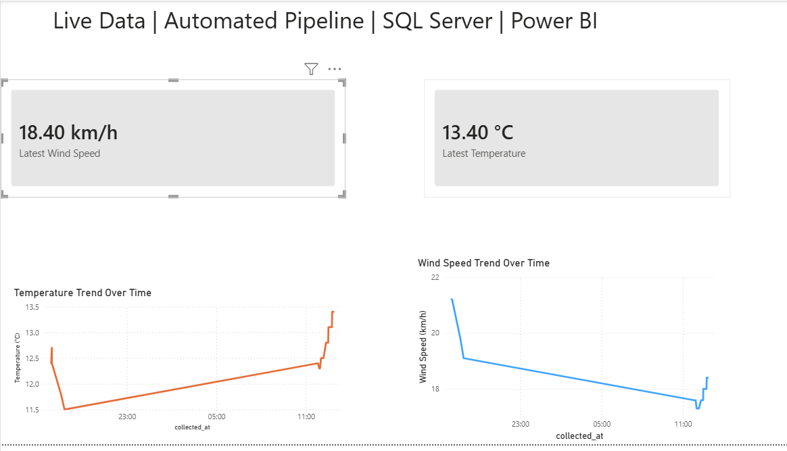

# real-time-weather-pipeline
Automated real-time weather data pipeline using Python, SQL Server, and Power BI
# 🌦 Real-Time Weather Data Pipeline

## 📌 Overview
This project demonstrates an end-to-end automated data pipeline that collects live weather data from an external API, stores it in SQL Server, and visualises insights using Power BI.

---

## ⚙️ Architecture
API → Python → SQL Server → Power BI

---

## 🚀 Features
- Automated data ingestion using Python
- Real-time data storage in SQL Server
- Scheduled execution using Task Scheduler
- Interactive Power BI dashboard
- KPI tracking (latest temperature & wind speed)

---

## 🛠 Technologies Used
- Python (requests, pandas, pyodbc)
- SQL Server
- Power BI
- Windows Task Scheduler

---

## 📊 Dashboard Preview

---

## ▶️ How to Run

1. Install dependencies:
 pip install -r requirements.txt

2. Run the script:
   python weather_pipeline.py

3. Set up Task Scheduler for automation

---

## 💡 Key Learning
- Built an automated ETL pipeline
- Handled real-time data ingestion
- Created dynamic dashboards using DAX
- Solved real-world data issues (datetime, duplicates)

---

## 📬 Author
Narmadhadevi Palaniappan
